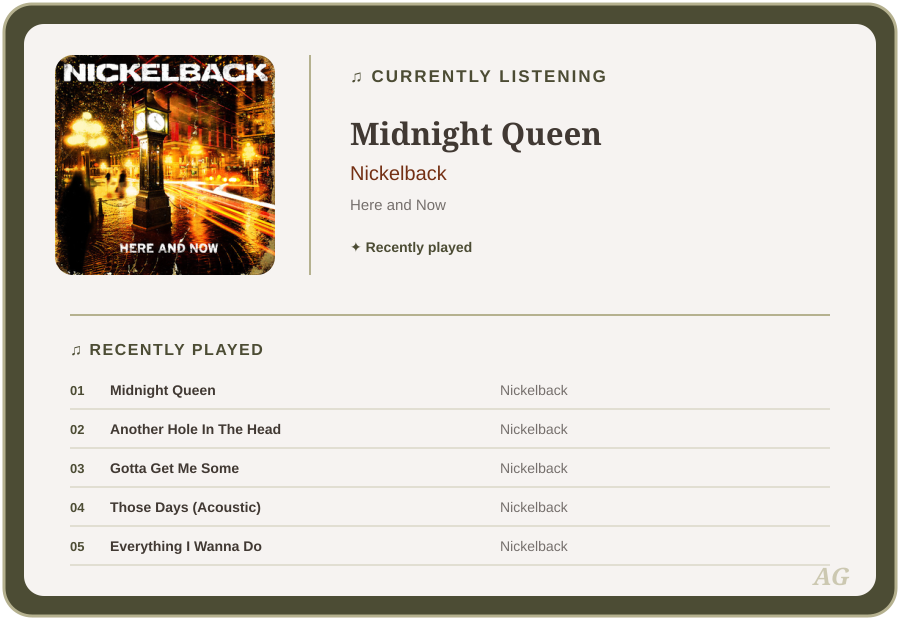
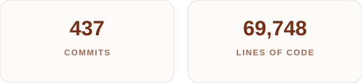

<!-- Header -->

  <strong>Web Developer</strong>
  &nbsp;✦&nbsp;
  <strong>Software Engineer</strong>
  &nbsp;✦&nbsp;
  <strong>Android Developer</strong>

<!-- About Me -->
## 🌱 About Me

I'm a developer who enjoys turning ideas into practical, user-focused
applications across web, mobile, and full-stack development.
I care about creating experiences that are intuitive, accessible, and
responsive across different devices and screen sizes.
I enjoy solving real-world problems through thoughtful design, clean code,
and continuous learning.

- **Building practical application** that turn ideas into useful, real-world solutions. I enjoy creating software with a clear purpose — applications that solve problems, improve experiences, and provide genuine value to the people using them.
- **Designing for people** by prioritizing accessibility, usability, and responsive experiences. I believe great software should feel intuitive and welcoming, while working well across different devices, screen sizes, and user needs.
- **Growing as an engineer** by embracing new technologies, tackling challenging problems, and learning through hands-on projects. I believe one of the best ways to grow as a developer is simply to begin: start coding, start the project, make mistakes, figure out what went wrong, and keep improving. Every challenge and mistake is an opportunity to learn something new.

<!-- Lets Connect -->
## 🌿 Let's Connect

  

  

  

<!-- Currently listening -->
## 🪴 Currently Listening

  <i>A little music while I build ✦</i>

  

## 🌲 What I Build With

**Languages**

  
  
  
  
  
  
  

**Web**

  
  
  
  
  
  

**Android**

  
  
  
  
  
  

**Backend & Data**

  
  
  
  
  
  
  

**Tools**

  
  
  
  
  
  
  

<!-- GitHub Activity Stats -->
## 🌳 GitHub Activity

***Across active repositories I own - forks and archived repositories excluded:***

  

  

